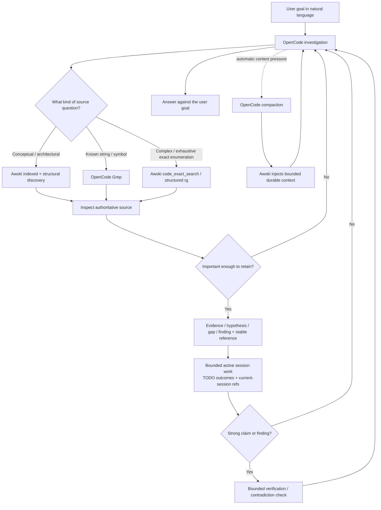

# Awoki

Awoki is a Docker-first harness for using OpenCode on long-running software and security investigations without treating chat history as the source of truth.

It combines scoped project state, structural and semantic repository retrieval, durable evidence references, bounded verification, compaction-safe continuity, and optional Burp integration. The goal is simple: let the agent investigate naturally while keeping important claims tied to the exact repository, evidence, and runtime state that produced them.

Awoki is in a **stabilization and usefulness-evaluation phase**. The core machinery is implemented and heavily regression-tested; the development priority is realistic security/code-review journeys, simplification, and removal of mechanisms that do not earn their complexity.

Release metadata is kept in [`pyproject.toml`](pyproject.toml) and [`.harness/manifest.json`](.harness/manifest.json); release history belongs in [`CHANGELOG.md`](CHANGELOG.md). The README intentionally avoids pinning a release number so this overview does not become stale when patch releases move forward.

## Why Awoki exists

Long agent sessions fail in predictable ways:

- the model forgets why an earlier result mattered after compaction;
- semantic search is mistaken for proof;
- “no caller found” becomes “unreachable”;
- a repository changes while old evidence is still being cited;
- hypotheses silently turn into facts;
- tool output is copied into chat and then becomes impossible to audit;
- an agent retries or self-reflects until the original task disappears;
- infrastructure/backend failures get reported as product success or product failure.

Awoki treats those as engineering problems rather than prompt-writing problems.

Its central idea is:

```text
natural investigation
      ↓
important observations / hypotheses / evidence are promoted
      ↓
stable IDs + provenance + human labels
      ↓
bounded verification and contradiction handling
      ↓
durable state survives compaction/restart
      ↓
natural conversation continues
```

The user should normally speak in plain language. The IDs, ledgers, evidence hashes, and machine contracts exist underneath the conversation when precision is needed.

## What using it should feel like

A normal security-review request can be as simple as:

> Review bearer-token authentication in this repository. Find where credentials can be rejected before authorization, whether authenticator reachability depends on configuration, and any bypass-relevant trust assumptions. Distinguish verified behavior from hypotheses and gaps.

Follow-ups stay natural:

> What are your strongest two hypotheses?

> Show me the evidence for the first.

> Why did you save that evidence?

> What would disprove this finding?

> Check that.

> Continue where we were before compaction.

Awoki may internally retain objects such as `ev_...` evidence, `cand_...` source candidates, verification checkpoints, relations, or human-readable labels. You do not need to manage those IDs in ordinary use.

When a phrase is ambiguous, Awoki should not guess. A request such as “the OAuth evidence” can return multiple candidates and require disambiguation; the stable ID remains authoritative.

## What Awoki is not

Awoki is not:

- a replacement for source-code reasoning with RAG;
- a database that automatically declares model output true;
- an autonomous scanner that silently widens scope or modifies repositories;
- a reason to store every model thought;
- a generic shell wrapper;
- a guarantee that static evidence proves runtime reachability;
- a hosted security product with a polished multi-user authorization plane.

The design intentionally keeps **analytical reasoning flexible** while making identity, provenance, scope, evidence lifecycle, and strong verification claims stricter.

## Architecture at a glance

Preferred deployment:

```text
host
  ├─ SSH client ──────────────────────────────┐
  ├─ optional Burp MCP on host loopback       │
  └─ optional remote embedding/rerank APIs    │
                                              ▼
Docker network                         awoki-opencode-ssh
  ├─ qdrant                             ├─ OpenCode
  └─────────────────────────────────────├─ Awoki MCP
                                        └─ baked Awoki source
```

Important boundaries:

- OpenCode and Awoki MCP run in the SSH container.
- Qdrant is a separate container and stores derived semantic vectors.
- Remote embeddings are optional for local/structural review and required only for semantic vector materialization.
- Remote reranking is optional.
- No Docker socket is mounted into the OpenCode container.
- Repository/source files and continuity state are canonical; FTS/Qdrant are rebuildable derived indexes.
- Awoki does not persist private chain-of-thought. Runtime anomaly tracking is structural metadata only.

See [`docs/ARCHITECTURE.md`](docs/ARCHITECTURE.md) for the detailed topology and [`docs/AWOKI_IDENTITY.md`](docs/AWOKI_IDENTITY.md) for the dense design/invariant map.

### How a normal investigation flows



The key separation is deliberate: retrieval and lexical tools help **discover** relevant code; exact current source remains the authority for behavioral claims. Durable state is promoted only when it is useful for continuation, evidence, or verification. Compaction restores the active working set and important project state instead of relying only on conversational memory.

## Requirements

Host requirements:

- Docker Desktop or Docker Engine with **Docker Compose v2**
- `git`
- `ssh` and `ssh-keygen` (OpenSSH client tools)
- `make`
- Python **3.12+** for host-side Awoki helpers and validation

The preferred OpenCode runtime is built inside Docker. You do **not** need a host OpenCode installation for the SSH deployment.

Optional external services:

- OpenAI-compatible embedding endpoint for semantic retrieval/vector indexing
- TEI or compatible HTTP reranker
- PortSwigger Burp MCP on the host for live Burp workflows

Local structural/FTS repository work can be used without authorizing remote embedding.

## Install

The recommended operator path is **Docker + OpenCode Web + SSH/tmux attach**. The container starts one authenticated OpenCode Web backend by default on host loopback, while the SSH TUI attaches to that same backend through `awoki-opencode`. tmux is optional process/UI convenience, not an Awoki correctness requirement.

### First install on the host

Clone or unpack Awoki into a writable Git checkout. For a person installing on a terminal, the recommended path is the guided installer:

```bash
./install-awoki.sh
# equivalent Make target:
make install-interactive
```

The wizard creates/refreshes `.env` without silently discarding existing values, asks about the Compose/SSH/Web settings, and optionally configures embedding and reranker endpoints/credentials. It then creates the ignored user OpenCode configuration at `.opencode-state/config/opencode.jsonc` and explicitly gives you a chance to paste/edit custom provider and model configuration **before Docker is built**. The tracked root `opencode.jsonc` is Awoki's project configuration; personal provider configuration normally does not belong there.

Before any Docker build/start the wizard initializes only local layout/SSH material, validates the user OpenCode JSONC plus Awoki's static configuration, and stops at an explicit **pre-build configuration review**. The menu deliberately separates configuration from execution: options 1-4 only edit/review/validate; Docker starts only when you choose `5) BUILD/START Docker now` and then answer a final confirmation. Choosing the default option `1` therefore opens the custom OpenCode provider config and does **not** build anything. Docker runtime conflict reconciliation happens only after that final build confirmation. After startup the wizard can optionally launch OpenCode's provider credential-login or MCP-add wizard, then run `make opencode-runtime-check`. Before it is allowed to print the final **Awoki ready** summary, it always runs an SSH client readiness gate: the host private/public key pair must exist and match, the running container's `/home/op/.ssh/authorized_keys` must match the host public key, and a real `BatchMode` public-key login must succeed. `--skip-runtime-check` skips the broader runtime check only; it does **not** skip SSH readiness.


### Which OpenCode config should I edit?

For your own provider/model configuration, edit the host file:

```text
.opencode-state/config/opencode.jsonc
```

Inside the container it appears as:

```text
/home/op/.config/opencode/opencode.jsonc
```

This is the recommended place to paste a custom OpenCode `provider` block. `.opencode-state/` is ignored by Git and excluded from the Docker build context, so personal provider configuration is not accidentally committed or baked into the image. OpenCode merges this user config with Awoki's project config. The tracked root `opencode.jsonc` remains Awoki-owned project configuration for MCP, instructions, permissions, and continuity behavior; edit it only when intentionally changing Awoki itself. Do not use `opencode.container.jsonc` as the personal provider-config location.

After installation, update provider/model configuration with:

```bash
$EDITOR .opencode-state/config/opencode.jsonc
make opencode-user-config-check
make opencode-config-reload
```

`make opencode-config-reload` does **not** rebuild the Awoki image. It validates the JSONC, restarts only the OpenCode SSH/Web service so OpenCode reloads the bind-mounted user config, waits for the runtime again, and runs the runtime check. The service restart terminates the current Web/TUI backend and tmux processes in that container, but persisted OpenCode/Awoki state remains on the host mounts. If the runtime is stopped, the command only validates the file; the next normal start loads it automatically.

Prefer OpenCode's credential store for provider API credentials when possible. From a running install use:

```bash
make opencode-auth
```

The installer offers the same provider credential-login step after startup. If a custom provider requires a credential directly in user JSONC, remember that the file is still plaintext on the host even though it is ignored by Git and excluded from the image build context.

For a release/source ZIP, `bootstrap-awoki.sh <archive-or-https-url> [target-dir]` handles the outer replacement flow: if the target already exists it offers to move the previous checkout aside or choose a different target, downloads when given an HTTPS URL, extracts the new checkout, then launches `install-awoki.sh`. It never silently deletes an existing checkout. A normal GitHub Download ZIP has no `.git`; the bootstrap explains that boundary and can create a local baseline `HEAD` for runtime/testing, while a real `git clone` remains required when you want authentic upstream history for development/publishing.

If you **replace or re-clone Awoki at a filesystem path that previously ran Awoki containers**, `./init-awoki.sh` gives the checkout an ignored runtime-instance identity and startup compares it with existing Compose containers before any bind-mount probe. The interactive installer asks before removing an unambiguously stale **same-path** runtime; the lower-level non-interactive launcher keeps the safe auto-recovery behavior. Startup also verifies the exact Docker owner of every published runtime port, so a Docker Desktop orphan that `docker compose ps` no longer enumerates is still classified by Compose project/service, checkout path, and runtime identity. Docker Desktop `/host_mnt/...` and the equivalent macOS host path are treated as the same checkout only when they resolve to the current root. Safe same-path recovery removes only the exact stale container IDs with `docker rm -f` and never passes `-v`, preserving named volumes and `data/qdrant`.

A **different live Awoki checkout** remains a hard safety boundary for the low-level launcher: `make opencode-ssh-up` will not stop or replace it. The interactive installer converts that refusal into an explicit operator menu: (1) stop only the other checkout's running `awoki-opencode-ssh`/`qdrant` containers and continue, preserving the containers/volumes/data; (2) keep both installations running and choose a distinct Compose project plus free SSH/Web/Qdrant/Lavish loopback ports for the new checkout; or (3) abort with both installations untouched. If option 2 changes `.env`, the installer reruns static validation, shows the complete redacted pre-build review again, and asks before proceeding. Non-Docker listeners or containers whose identity cannot be established still fail closed instead of being touched.

The deterministic/manual path remains supported for automation:

```bash
cp .env.example .env
./init-awoki.sh
make dependencies-check
make dev-preflight
make install-opencode-ssh
make opencode-runtime-check
```

Only run `make opencode-runtime-check` after startup succeeds.

`./init-awoki.sh` creates the local runtime layout and host SSH client key pair. `make install-opencode-ssh` / `make opencode-ssh-up` then inject only the validated public key into the container; the private key stays on the host. Startup now hard-fails if the host key is missing, if the `.pub` does not derive from that private key, if the container authorizes a different key, or if the real SSH login fails. You can rerun the same contract directly with `make opencode-ssh-client-check`. Do not use raw `docker compose up` as the normal first-start path.

If `make install-opencode-ssh` or `make opencode-ssh-up` fails, stop at that failure and fix the startup problem first. Do not run `make opencode-runtime-check` against an old or partially started container; its secondary errors can obscure the original startup failure.

OpenCode Web is enabled by default at `http://127.0.0.1:4096`. Awoki secures `.opencode-state/` and `web-auth/` as `0700` and generates a strong random Basic-Auth password in the ignored `.opencode-state/web-auth/password` single-link file with mode `0600`; retrieve it explicitly with `make opencode-web-password`. The password is not placed in Compose service environment/configuration or command-line arguments. Set `AWOKI_OPENCODE_WEB_ENABLED=0` to retain standalone SSH-only OpenCode behavior.

Connect with the command printed by the installer. It prints an absolute key path so the command still works when copied into another directory, for example:

```bash
ssh -i "/path/to/awoki/.ssh-container/id_ed25519" -o IdentitiesOnly=yes -o UserKnownHostsFile="/path/to/awoki/.ssh-container/known_hosts" -o StrictHostKeyChecking=accept-new -p 2222 op@127.0.0.1
```

Before connecting manually you can independently verify the exact key/container/login contract with:

```bash
make opencode-ssh-client-check
```

Awoki uses `.ssh-container/known_hosts` for this localhost service. You do **not** need to clear or edit your global `~/.ssh/known_hosts`; the printed command points SSH at the checkout-local trust file.

### Recommended editor workflow: VS Code Remote-SSH + Awoki terminal

For a graphical editor on macOS, the recommended Awoki workflow is **VS Code Remote - SSH without requiring the OpenCode VS Code extension**. Connect VS Code to the same loopback-only Awoki SSH endpoint, open `/awoki` or the exact managed project/repository path inside the container, and use VS Code's integrated remote terminal for OpenCode.

Example host SSH configuration:

```sshconfig
Host awoki
    HostName 127.0.0.1
    Port 2222
    User op
    IdentityFile /path/to/awoki/.ssh-container/id_ed25519
    IdentitiesOnly yes
```

Then use **Remote-SSH: Connect to Host... -> awoki**, open the container-side workspace, and in the integrated terminal:

```bash
cd /awoki
tmux new -A -s awoki
awoki-opencode
```

This keeps the editor, shell, repository paths, Awoki MCP, and OpenCode in the same container filesystem while the macOS VS Code process remains the local UI. The OpenCode IDE extension is optional convenience and is not required for this workflow; `awoki-opencode` continues to attach to Awoki's one authenticated OpenCode Web backend.

VS Code 1.91+ supports OSC 52 clipboard writes in its integrated terminal. For explicit remote-terminal clipboard support, enable these local VS Code user settings:

```json
{
  "terminal.integrated.enableOsc52": true,
  "terminal.integrated.macOptionClickForcesSelection": true
}
```

Awoki's tmux layer defaults mouse mode **off** so a Mac trackpad does not cause gpakosz/Oh my tmux! to intercept scrolling and automatically enter copy-mode. Toggle mouse mode temporarily with `<prefix> m` when pane selection/resizing by mouse is useful.

tmux copy-mode remains explicit and keyboard-friendly. With the vendored gpakosz bindings, use `<prefix> Enter`, then `v` to begin selection and `y` to copy. The copied text is retained in the tmux buffer and, when the terminal advertises OSC 52 support, forwarded to the macOS clipboard using tmux `set-clipboard external`. This is deliberately narrower than `set-clipboard on`: tmux itself may update the outside clipboard, but applications running inside tmux are not granted tmux-mediated clipboard writes.

For stock tmux muscle memory, `Ctrl-b [` is the traditional copy-mode binding and `Ctrl-b ]` pastes the latest tmux buffer; `]` is not the copy-mode key.

### Recommended persistent terminal session: tmux + OpenCode

Inside the SSH container:

```bash
cd /awoki
tmux new -A -s awoki
awoki-opencode
```

`awoki-opencode` attaches the TUI to the already-running Web backend, so browser and SSH use the same OpenCode sessions/state. `tmux new -A -s awoki` creates the `awoki` terminal session the first time and reattaches to it later. If SSH drops, the Web backend remains alive independently; reconnect and run the same tmux/client commands.

To detach deliberately without stopping OpenCode, press `Ctrl-b d` (or `Ctrl-a d`; Awoki's tmux accepts either prefix). Then leave SSH normally.

A useful tmux layout is one window for the attached OpenCode TUI and additional windows for shell/tests/logs. tmux survives **SSH disconnects**, but not **container recreation**. Mouse mode is off by default and can be toggled with `<prefix> m`; this avoids accidental copy-mode entry from Mac trackpad scrolling in VS Code/SSH terminals. The OpenCode Web backend is supervised by the container entrypoint and is not owned by tmux. After `make opencode-recreate`, the backend and attached TUI processes restart, while mounted Awoki/OpenCode state remains durable.

### Daily start / reconnect

On the host:

```bash
make opencode-ssh-up
make opencode-runtime-check
ssh -i "$PWD/.ssh-container/id_ed25519" -o IdentitiesOnly=yes -o UserKnownHostsFile="$PWD/.ssh-container/known_hosts" -o StrictHostKeyChecking=accept-new -p 2222 op@127.0.0.1
```

Then inside the container:

```bash
cd /awoki
tmux new -A -s awoki
```

If the attached TUI is not already running in that tmux session:

```bash
awoki-opencode
```

Stop the SSH/Qdrant deployment deliberately with:

```bash
make opencode-ssh-down
```

Stopping/recreating the container ends tmux/OpenCode processes, so do not use it as the normal way to disconnect from a live review. Detach tmux or simply close SSH instead.

After the runtime is up, continue with **Create a project and add a repository** below, then start the review in natural language. The complete installation/troubleshooting guide is [`INSTALL.txt`](INSTALL.txt); the SSH/tmux runtime details are in [`docs/OPENCODE_SSH.md`](docs/OPENCODE_SSH.md).

## OpenCode version policy

Awoki does not permanently hard-pin OpenCode to an old release.

A fresh image build defaults to **latest / untested**: it resolves the current OpenCode CLI and aligns the local OpenCode plugin/SDK packages with that resolved version. The resulting container is immutable; it does not silently auto-update while running.

Rebuild latest explicitly:

```bash
make opencode-recreate \
  OPENCODE_RECREATE_ARGS="--validate --no-cache --opencode-latest"
```

If a new OpenCode release regresses behavior, build a version you have chosen as last-known-good:

```bash
make opencode-recreate \
  OPENCODE_RECREATE_ARGS="--validate --no-cache --opencode-safe <VERSION>"
```

Safe mode is operator-selected. Awoki does not pretend that a version is “known good” merely because it built successfully.

## Configure retrieval

Copy `.env.example` and set only the services you intend to use.

For semantic retrieval, the key settings are:

```text
AWOKI_EMBEDDING_BASE_URL=
AWOKI_EMBEDDING_API_KEY=
AWOKI_EMBEDDING_DEPLOYMENT_ID=
AWOKI_VECTOR_SIZE=768
```

Optional reranking:

```text
AWOKI_RERANK_ENABLED=1
AWOKI_RERANK_URL=
AWOKI_RERANK_API_KEY=
AWOKI_RERANK_TIMEOUT_SECONDS=20
AWOKI_CODE_RERANK_TIMEOUT_SECONDS=
```

Leaving `AWOKI_CODE_RERANK_TIMEOUT_SECONDS` empty means code search inherits the shared `AWOKI_RERANK_TIMEOUT_SECONDS`.
If an older local `.env` still contains the historical stock 5-second code-rerank override, keep it only if that shorter timeout is intentional; otherwise clear the value so the shared timeout is inherited.

Qdrant is part of the Docker deployment. Semantic materialization is explicit: opening a project does not silently upload repository content to an embedding service.

## Create a project and add a repository

Projects are managed scopes under `workspace/projects/<project>/`.

From the writable host checkout:

```bash
python3 .harness/project.py create review1

git clone <repository-url> \
  workspace/projects/review1/repo/target

python3 .harness/project.py repo-add \
  --default \
  review1 \
  target \
  repo/target
```

Inside OpenCode, attach it naturally or through the precise MCP interface:

```text
Resume project review1.
```

or:

```text
project_open(name="review1", create_if_missing=false)
project_repo_list(name="review1")
```

`project_open` intentionally returns a **slim orientation view**: repository/readiness state, the current session TODO/reference working set, a few recent prior-material pointers, and bounded continuation guidance. It does not dump SITUATION, HANDOFF, reflection lists, and important knowledge simultaneously. Use `project_resume` when you explicitly need the dense continuity view, or `project_search` to retrieve older project knowledge selectively.

A project can contain multiple independently versioned repositories.

## Prepare a repository

For ordinary review, prefer the durable repository-preparation parent job:

```text
repository_prepare_start(
  name="review1",
  repo="target",
  mode="local",
  resume_goal="continue the requested review after LOCAL_READY"
)
```

`mode="local"` builds/verifies local structural and FTS state without authorizing remote embedding.

When you explicitly want semantic vector materialization and configured backend readiness:

```text
repository_prepare_start(
  name="review1",
  repo="target",
  mode="full",
  resume_goal="continue the requested review after FULL_READY"
)
```

The job is detached. Do not make the model poll it in a tight loop. Check the returned `rpr_...` job later with `repository_prepare_status`, or let the bounded continuation mechanism resume after a terminal transition.

Readiness meanings:

- `LOCAL_READY`: structural/FTS review state is current.
- `FULL_READY`: local state plus exact vector membership and configured semantic backend readiness are current.

A partial vector population never counts as `FULL_READY`.

## Natural security/code-review workflow

A useful review should normally progress through these phases without forcing you to operate the underlying machinery directly.

### 1. Establish scope

Awoki binds analysis to the managed project, repository, source root, and current revision/assurance state.

For Git repositories, a clean deeply checked snapshot can be reported as `VERIFIED_SNAPSHOT`. Weaker states such as `WORKING_TREE_BOUND` or `FILESYSTEM_BOUND` remain usable but do not claim immutable snapshot authority.

### 2. Discover implementations

`codebase_search` combines structural/lexical retrieval and, when authorized/current, semantic retrieval and optional reranking.

Search results are **candidates, not proof**.

Exact search is complementary rather than forbidden:

- use OpenCode `Grep` for ordinary known string/symbol lookup;
- use Awoki `code_exact_search` when you need full ripgrep-style power—multiple expressions, counts, files-with-matches, context, precise globs/exclusions, hidden/ignored-file policy, or exhaustive exact enumeration—without constructing a Bash command;
- use Awoki `code_text_search` only when a claim needs its stronger materialized/resumable exhaustive-coverage contract or transport recovery.

For conceptual/architectural questions, start with Awoki indexed discovery. For an exact enumeration question, `code_exact_search` is a first-class source tool and does not need semantic retrieval to fail first. Lexical hits still remain discovery until the relevant source is inspected.

Example:

```text
code_exact_search(
  patterns=["GetID\\(", "ErrAuthenticator"],
  mode="files",
  include_globs=["*.go"],
  exclude_globs=["*_test.go"]
)
```

The tool invokes `rg` directly without a shell, stays inside the selected managed repository, strips ambient credentials from the child-process environment, and returns structured bounded results with continuation metadata.

### 3. Resolve exact behavior

Awoki can use exact definitions, callers/callees, bounded flow graphs, and hash-checked source windows to determine what the implementation actually does.

For important supported primitive semantics, deterministic helper checks can replace model memory/mental arithmetic. Repository code itself is not executed by those helpers.

### 4. Form hypotheses and gaps

A missing direct caller can become:

```text
observation: no direct static caller found in searched scope
hypothesis: implementation may be configuration-instantiated
gap: inspect registration/factory/config selection
```

It should **not** automatically become “unreachable.”

### 5. Promote only important things

Evidence or conclusions worth surviving compaction can receive stable IDs and human metadata:

```text
ev_...
label: Bearer-token authenticator selection
why_saved: Needed to verify whether normal bearer requests can reach the implementation.
```

Human labels help navigation; IDs remain authoritative.

### 6. Reflect at meaningful boundaries

Awoki's intended self-reflection is bounded and event-driven, not recursive introspection.

Useful reflection triggers include:

- promoting a hypothesis into a security finding;
- making a broad/universal claim;
- using negative search evidence;
- contradicting an earlier conclusion;
- declaring a security property verified;
- producing the final review conclusion.

A checkpoint asks structurally: what is observed, what is inferred, what supports/refutes the claim, and what remains unknown. It does not persist private reasoning text.

### 7. Verify strong claims

When you ask “prove this” or Awoki is about to present a strong finding, the verification boundary becomes stricter. A result may be `VERIFIED`, `VERIFIED_WITH_FINDINGS`, `INCOMPLETE`, `CONTRADICTED`, `BLOCKED`, or `NOT_APPLICABLE` depending on the evidence.

Insufficient evidence is not a failed review. It is an honest boundary.

## Compaction and long-running work

OpenCode can compact context automatically. Awoki therefore avoids making conversation text the canonical state.

For a multi-step natural-language review, OpenCode's native TODO list acts as the small **active working set**. The agent should summarize the user's requested outcomes/constraints into a few bounded TODOs rather than copying the raw prompt or every intermediate thought. Awoki mirrors that projection outside chat, so the governing deliverables can survive compaction without introducing a separate session-intent ledger. A newer user instruction always wins.

Durable state can retain:

- project/repository identity;
- TODO/work continuity for the current goal/deliverables;
- important evidence and source candidates;
- hypotheses/findings/gaps and relationships;
- human reference labels and `why_saved` metadata;
- verification checkpoints;
- acceptance/test state when Awoki itself is being tested;
- bounded compaction generation/history.

Compaction events are structurally classified when OpenCode exposes the signal:

- `automatic_context_pressure`
- `explicit_request`
- `unknown`

After compaction, the agent should recover durable state rather than reconstruct the investigation from a lossy prose summary.

Human references are also session-scoped for compaction injection: references actually used in the current session (plus any required by an active acceptance run) are included in the working context. Older project references remain searchable, but they are not injected merely because they were recently saved in another investigation.

## Evidence and human references

Stable IDs exist for machine precision. Natural language exists for humans.

You can ask:

> What was the bearer-token evidence?

Awoki can resolve a human label/alias to an `ev_...` reference and then retrieve the authoritative object. If multiple matches are too close, resolution returns `ambiguous` and no stable ID is silently selected.

Candidates can distinguish where they were first materialized from every captured evidence artifact in which they were later observed.

Rich evidence stays outside compact ledgers. Compact records contain bounded observations and references instead of giant copied payloads.

## Security boundaries

Awoki deliberately avoids several dangerous conveniences:

- opening a project does not authorize remote embedding;
- semantic similarity never becomes behavioral proof;
- native shell/Read/Grep are not silent substitutes for an available Awoki MCP operation in machine-enforced acceptance workflows;
- failed/blocked repository preparation is not retried indefinitely;
- generic model-turn recovery does not share the epistemic corrective-action budget;
- generic reasoning/tool continuation anomalies are observed structurally and do not trigger unbounded auto-`continue` loops;
- reasoning text is never persisted by the runtime diagnostic layer;
- target-repository Git/search subprocesses strip retrieval/provider credentials as defense in depth;
- hostile same-user target code still requires a separate credential-free sandbox.

See [`docs/RELIABILITY.md`](docs/RELIABILITY.md), [`docs/CONTINUITY.md`](docs/CONTINUITY.md), and [`docs/FILESYSTEM.md`](docs/FILESYSTEM.md) for the detailed contracts.

## Burp integration

Awoki can connect OpenCode to a PortSwigger Burp MCP running on the host. Read-only Burp investigation can be used naturally; side-effecting operations have explicit command boundaries such as sending one selected request or staging Repeater/Intruder work.

See [`docs/BURP.md`](docs/BURP.md).

## Backup and restore

Awoki supports portable and full backups with verification. Portable backups favor migration and reindexing; full backups include derived index/Qdrant state and therefore have stricter compatibility checks.

```bash
make backup-portable
make backup-full
```

See [`docs/BACKUP_RESTORE.md`](docs/BACKUP_RESTORE.md).

## Validation

Useful maintainer gates:

```bash
make dependencies-check
make dev-preflight
make validate
make code-search-eval
make opencode-runtime-check
```

`make validate-runtime` additionally requires the real runtime parser/search/toolchain dependencies.

Runtime diagnostics:

```bash
make runtime-config
make embedding-benchmark
make reranker-benchmark
```

## Current development phase: prove usefulness, then simplify

The internal R9.1.6.x development line established the current stabilization baseline: R9.1.6.16 shifted from mechanism-building to realistic-use evaluation, R9.1.6.17 applied J1 friction fixes, R9.1.6.18 added the J2-backed structured exact search and slimmer `project_open`, and R9.1.6.19 clarified operator onboarding. **v0.1.0** is the first public semantic-versioned release of that stabilized line and includes the Docker Desktop/macOS SSH-bootstrap portability fix; no new analysis mechanism is introduced solely for the version transition.

The next evaluation phase uses realistic security/code-review journeys to answer:

- did retrieval materially improve the investigation?
- did reflection change an incorrect or over-broad conclusion?
- did durable state help after compaction?
- were IDs/references useful or intrusive?
- did any mechanism duplicate another one?
- which persisted objects were never useful again?
- could the same result be achieved with less machinery?

The evaluation plan and keep/simplify/remove criteria are in [`docs/USEFULNESS_EVALUATION.md`](docs/USEFULNESS_EVALUATION.md).

## Documentation map

Start here, then go deeper only when needed:

- [`CHANGELOG.md`](CHANGELOG.md) — recent release history and stabilization transition
- [`INSTALL.txt`](INSTALL.txt) — installation, update, safe-mode rollback, troubleshooting
- [`docs/OPENCODE_SSH.md`](docs/OPENCODE_SSH.md) — preferred SSH runtime, tmux/OpenCode workflow, reconnect and persistence boundaries
- [`docs/ARCHITECTURE.md`](docs/ARCHITECTURE.md) — runtime/storage/retrieval architecture
- [`docs/AWOKI_IDENTITY.md`](docs/AWOKI_IDENTITY.md) — dense maintainer/future-context identity and invariants
- [`docs/USEFULNESS_EVALUATION.md`](docs/USEFULNESS_EVALUATION.md) — stabilization and real-work evaluation program
- [`docs/OPERATOR_REFERENCE.md`](docs/OPERATOR_REFERENCE.md) — dense operational reference preserved from the former README
- [`docs/COMMANDS.md`](docs/COMMANDS.md) — OpenCode command surface
- [`docs/CODE_SEARCH.md`](docs/CODE_SEARCH.md) — repository retrieval and evidence semantics
- [`docs/CONTINUITY.md`](docs/CONTINUITY.md) — compaction/work/readiness continuity
- [`docs/RELIABILITY.md`](docs/RELIABILITY.md) — verification and acceptance boundaries
- [`docs/BURP.md`](docs/BURP.md) — Burp integration
- [`docs/BACKUP_RESTORE.md`](docs/BACKUP_RESTORE.md) — backup/restore model

## Maturity and publishing note

Awoki is suitable for experimentation and serious operator-controlled review work, but it should be understood as an actively stabilized engineering project rather than a finished turnkey security product. The project intentionally documents degraded states, incomplete verification, backend failures, and known trust boundaries instead of hiding them behind a generic PASS.

That honesty is part of the design.

## License

See [`LICENSE`](LICENSE).
