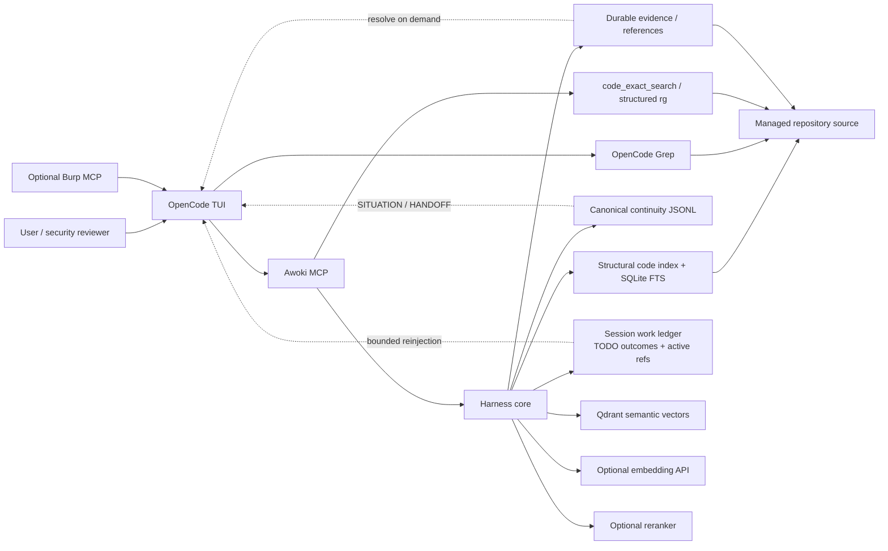

# Architecture

> Public overview: [`../README.md`](../README.md). Dense maintainer identity and invariants: [`AWOKI_IDENTITY.md`](AWOKI_IDENTITY.md). v0.1.6 is the current public stabilization patch release; architecture changes should be justified by realistic-work evidence from [`USEFULNESS_EVALUATION.md`](USEFULNESS_EVALUATION.md).

## Components

- `opencode.jsonc`: project OpenCode config; loads Awoki instructions, commands, skills, plugin, direct Burp MCP, and local Awoki MCP.
- `docker-compose.opencode.yml`: preferred OpenCode-over-SSH deployment with Qdrant and the OpenCode container.
- `docker-compose.yml`: Docker-backed Awoki MCP for host OpenCode mode.
- `.harness/server.py`: MCP server.
- `.harness/harness_core.py`: memory, scope, promotion, continuity adapters, and retrieval orchestration.
- `.harness/project_workspace.py`: project/session state and generated views.
- `.harness/rag_backend.py`: SQLite FTS, remote embedding adapter, Qdrant, and optional remote reranking.
- `.harness/code_search/engine.py`: repository retrieval orchestration, reciprocal-rank fusion, bounded structural promotion, concrete-symbol refinement, rank-based reranker integration, authority, diversity, and evidence-oriented result metadata.
- `.opencode/plugins/awoki-continuity.ts`: session identity, observable activity checkpoints, and bounded compaction context injection; it intentionally does not append system messages.
- `.opencode/skills/`: on-demand workflows.
- `.opencode/commands/`: minimal natural-language front doors plus precision/safety commands; see `docs/COMMANDS.md`.

## Runtime topology

```text
macOS host
  ├─ Burp MCP at 127.0.0.1:9876
  ├─ SSH client to 127.0.0.1:2222
  └─ operator-configured route to an optional remote retrieval host

optional remote retrieval host
  ├─ OpenAI-compatible embeddings at an operator-configured endpoint
  └─ optional reranker at an operator-configured endpoint

Docker network: awoki
  ├─ qdrant
  │    http://qdrant:6333
  └─ awoki-opencode-ssh
       OpenCode TUI
       Awoki MCP child process
       immutable Awoki source baked into image
       explicit writable runtime mounts
       Burp via host.docker.internal:9876
```

No Docker socket, host PID namespace, host network, or privileged mode is used.

### Component and data-flow view



Authority is not symmetric in this diagram. Repository/source files and canonical continuity records are truth stores; SQLite/Qdrant are rebuildable discovery indexes, and reranking only changes candidate ordering. Native exact-search tools complement Awoki rather than becoming proof by themselves.

## Storage authority

```text
continuity JSONL + source files   canonical truth
SQLite FTS                       exact derived index
remote embeddings + Qdrant       semantic derived index
remote reranker                  optional result ordering only
SITUATION/HANDOFF                generated bounded views
```

Qdrant is core to semantic retrieval but is rebuildable. It never replaces canonical continuity.

Project repository identity is separate from project identity. A project can use one
legacy root at `repo/` or multiple registered children under `repo/<repo-id>/`.
Structural SQLite may be shared per project, but branch state, file/chunk rows, vector
membership, evidence IDs, and completeness are repository-qualified.

## Retrieval flow

```text
project_search / search_rag
  ├─ query project-first SQLite FTS
  ├─ embed query through configured remote OpenAI-compatible endpoint
  ├─ query Qdrant only when the safe document-set hash is current
  ├─ include safe JSONL fallback candidates
  ├─ fuse with weighted reciprocal-rank fusion
  └─ optionally send bounded candidate text to remote HTTP reranker

codebase_search / /codebase
  ├─ resolve the legacy root or enabled registered repositories and bind each to exact-root Git/filesystem evidence assurance
  ├─ apply Awoki eligibility before parser or embedding access
  ├─ parse symbol-aware chunks into dedicated `awoki_code.sqlite`
  ├─ maintain definitions, references, call edges, and active-branch membership
  ├─ search structural exact/FTS and a dedicated content-addressed Qdrant collection
  ├─ route natural language deterministically, including a real lexical-only diagnostic mode
  ├─ preserve per-stage FTS/Qdrant/fusion rank+score provenance
  ├─ add bounded verified structural candidates from strong test/config hits (candidate generation only)
  ├─ refine strong coarse production containers into bounded concrete callables, requalifying exact children already present in discovery
  ├─ allocate the finite reranker window across broad/focus/refined lanes, then optionally rerank that selected window against the original query with explicit attempted/applied telemetry
  ├─ apply query-intent authority preference and deterministic result diversity without globally excluding tests/config
  ├─ for flow questions, resolve an entry point and build a bounded `code_flow_graph`
  ├─ inspect exact current source through bounded hash-checked `code_source_window` + evidence id
  ├─ use `code_validate_claim` selectively for supported atomic propositions
  ├─ use allow-listed `code_semantics_check` for deterministic Go primitives when relevant
  └─ return evidence-labeled structural/source conclusions, separate from project memory

raw lexical fallback
  ├─ conceptual questions: Awoki structural/indexed discovery first
  ├─ ordinary exact lookup: OpenCode native Grep
  ├─ complex/exhaustive exact enumeration: `code_exact_search` with structured ripgrep options
  ├─ `code_text_search` when structured exact search cannot establish the machine-complete coverage/transport guarantees required
  ├─ exhaustive declared-scope textual scan; total match/file universe is never token-capped; Git-ignored untracked files are opt-in forensic scope
  ├─ bounded giant-line-safe pages with snapshot-bound cursors until search_complete
  ├─ `.harness/bin/code-search-fallback` only when MCP itself is unavailable
  └─ never treat lexical fallback output as behavioral proof

/code-validate-claim
  ├─ natural-language verification orchestration and broad-request decomposition
  └─ code_validate_claim MCP primitive: exact current source + atomic AST/graph proof obligations, with no semantic backends

repository evidence hierarchy
  ├─ repository-qualified exact configured root (legacy repo/ or registered repo/<repo-id>; intentional non-Git roots allowed)
  ├─ HEAD/raw tree plus mutable Git view identity (replace refs, sparse view)
  ├─ declared lexical repository universe + completeness
  ├─ exact source SHA-256 and optional Git blob IDs in `code_source_window`
  ├─ compact self-contained `evidence_id` verified later with `code_evidence_verify`
  ├─ structural relationships / source role
  └─ deterministic language/runtime observation when a claim depends on one

structural reference persistence
  ├─ identical parser reference emissions are deduplicated deterministically
  └─ conflicting reuse of one reference identity fails closed before that file occurrence is replaced

project_capture reconciliation
  └─ search prior continuity records only, including memory_only Qdrant filtering
```

Reranking is independently optional. With `AWOKI_RERANK_ENABLED=0`, Awoki returns the fused order. With fallback mode, a reranker error is reported but does not discard search results.

## Remote embedding configuration

```env
AWOKI_EMBEDDING_PROVIDER=openai
AWOKI_EMBEDDING_MODEL=text-embeddings-inference
AWOKI_EMBEDDING_DEPLOYMENT_ID=jinaai/jina-embeddings-v2-base-code
AWOKI_EMBEDDING_BASE_URL=http://embedding.example.invalid:8000/v1
AWOKI_EMBEDDING_API_KEY=
AWOKI_EMBEDDING_BATCH_SIZE=32
AWOKI_EMBEDDING_NORMALIZE=1
AWOKI_VECTOR_SIZE=768
AWOKI_QDRANT_URL=http://qdrant:6333
AWOKI_QDRANT_COLLECTION=awoki_jina_embeddings_v2_base_code_768
AWOKI_QDRANT_RECREATE_ON_DIM_MISMATCH=0
```

A TEI deployment selects the actual model with
`--model-id jinaai/jina-embeddings-v2-base-code`. The OpenAI-compatible request
uses `text-embeddings-inference` as its model field. The returned vectors are
768-dimensional. A new model or vector dimension must use a new collection or
an explicitly authorized rebuild; automatic destructive recreation is disabled
by default.

Only material allowed by project indexing policy is sent to that endpoint. This includes continuity records, generated views, reports, and selected source chunks when permitted; no-RAG or excluded material never leaves through embedding or reranking.

If embeddings are temporarily unavailable, canonical capture and generated continuity continue. Semantic indexing/search reports the failure rather than fabricating vectors.

## Remote reranker configuration

```env
AWOKI_RERANK_ENABLED=1
AWOKI_RERANK_PROVIDER=tei
AWOKI_RERANK_URL=http://reranker.example.invalid:8000/rerank
AWOKI_RERANK_MODEL=
AWOKI_RERANK_FAIL_MODE=fallback
```

For native TEI, the server-side `--model-id` chooses the reranker, so the client
model field remains empty. The provider receives the query and a bounded
candidate list after fusion. It does not receive arbitrary workspace files.

## Sensitive memory

There is no built-in credential backend. Normal secret-like content is redacted. Explicit user-directed sensitive capture preserves plaintext in a secret/no-RAG continuity record, excludes it from generated views and automatic search, and requires explicit sensitive retrieval. No encryption claim is made.

## Container boundary

The Awoki repository is copied into the image through `.dockerignore`; the host checkout is not mounted over `/awoki`. Writable mounts are explicit runtime trust domains. This prevents target repositories from modifying Awoki policy/plugin source and prevents ignored host files such as `.env` or SSH private keys from becoming readable through a broad repo mount.


The OpenCode SSH image pins Node 22 for OpenCode and ad-hoc Lavish compatibility.

## Runtime data migration

Runtime backup/restore is implemented by `.harness/backup.py` and exposed through `.harness/bin/awoki-backup` plus Make targets. Portable archives capture canonical workspace/global data and omit derived indexes; full archives add stopped Qdrant and local/project/global indexes. Restore verifies SHA-256 integrity, archive path safety, resolved destination separation, overwrite state, complete service quiescence, and full-backup retrieval compatibility before applying data. Installation credentials and OpenCode state require explicit opt-in. See `docs/BACKUP_RESTORE.md`.


### Optional Burp adapter boundary

Burp connectivity may be configured at the installation level, but project state is not Burp-shaped by default. `workspace/projects/<project>/artifacts/burp/` is lazy and appears only after explicit Burp writes. Generic global/project RAG excludes Burp inventories; Burp archive discovery stays behind Burp-specific workflows.

### Repository evidence roles

The code retrieval layer preserves production source, tests, fixtures,
config/schema, documentation, and generated/vendor evidence without globally
filtering them out. Result metadata labels both `source_role` and a finer
`authority_class`. Natural-language implementation/security queries softly prefer
query-relevant production functions/methods; explicit test/config questions favor
those roles. Structural edges from a strong non-production hit can generate
production candidates but never make them authoritative by connectivity alone;
they are re-evaluated against the original query before authority/diversity can
raise them. Raw and final stage scores remain visible for diagnosis. Source
remains authoritative for runtime implementation and tests corroborate intended
behavior and regressions.

### Repository provenance assurance

Awoki distinguishes `VERIFIED_SNAPSHOT`, `WORKING_TREE_BOUND`, and
`FILESYSTEM_BOUND`. Deep index/verify operations materialize the stronger Git
evidence; interactive search compares a cheap mutable-view fingerprint instead
of rerunning the deep audit on every question. The hot fingerprint tracks HEAD,
replacement/sparse state, a stat identity for the Git index, and Git stat-trust
configuration; deep verification additionally streams a SHA-256 of index bytes
and inspects `assume-unchanged`/manual `skip-worktree` flags. Replace refs, sparse
checkout, submodules, active content filters, dirty state, or weakened stat trust
reduce assurance but never become source-censorship rules. Passive Git inspection
disables fsmonitor and neutralizes configured filter commands, so
repository/local helper executables are not run merely to prove cleanliness.

Git author/committer identity is deliberately outside snapshot assurance. Those
fields are recorded as metadata claims. A signature may be recorded as present,
but Awoki does not automatically execute configurable GPG/SSH verifier programs;
signature trust is a separate explicit operation. Evidence IDs are checksummed
stale-detection locators, not signatures. Local evidence cannot prove that
rewritten/unreachable remote history never existed when no independent anchor
remains.


## SSH runtime environment handoff

Docker Compose configuration belongs to the container process environment, while `sshd` login shells intentionally start without that ambient state. The OpenCode SSH entrypoint therefore writes an allowlisted, shell-escaped, root-owned `0640` snapshot under `/run/awoki/runtime.env` on tmpfs. `mcp-auto` validates the snapshot and relaunches the server through the clean internal `mcp` profile, which reconstructs only the Awoki/Qdrant/retrieval/Burp variables needed by MCP instead of carrying arbitrary SSH/OpenCode `PYTHON*`, loader, proxy, or unrelated state. Shell-side diagnostics use `awoki-runtime-env` profile-filtered environments instead of sourcing the file. Retrieval/internal-MCP profiles are secret-bearing and only for trusted code. Burp and Lavish use separate non-retrieval profiles; direct live Burp remains its own `mcp.burp` control plane. Explicit reranker-key indirection is resolved fail-closed before network use in every runtime, with an additional SSH-startup check. These profiles minimize accidental credential inheritance but are not a same-user sandbox because stdio `mcp-auto` must be able to read the tmpfs snapshot. Repository-facing child processes are separately constrained: passive Git reads and exhaustive ripgrep scans receive a credential-free environment with provider secrets, SSH-agent handles, Python/loader injection variables, and caller-selected Git SSH helpers removed; deterministic Go semantics runs under an even smaller fixed environment. The vector worker intentionally retains retrieval credentials because embedding/Qdrant are its job, but its Git/rg descendants cross back into the credential-free subprocess boundary.
