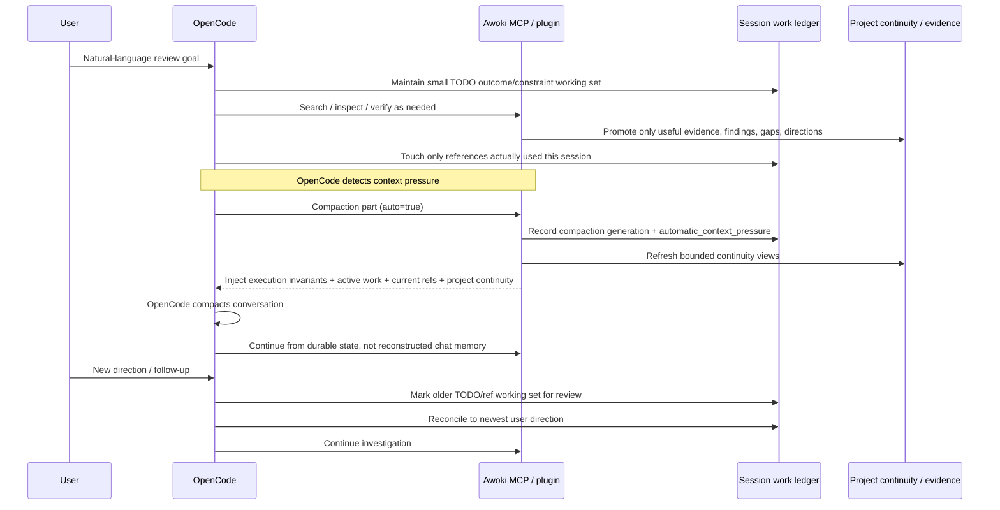

# Awoki continuity architecture

This document is the authoritative specification for project continuity in Awoki.
Other project, memory, RAG, Burp, and OpenCode documentation must defer to it when
there is a conflict.

## Philosophy

Awoki is a persistent project companion, not a task-management system.

The user drives project direction in natural language. The workspace accepts
arbitrary material. Awoki observes meaningful changes, stores concise operational
continuity, and generates enough bounded context to resume accurately.

The core flow is:

```text
free workspace activity
  -> concise continuity records
  -> generated SITUATION.md and HANDOFF.md
  -> targeted retrieval only when useful
```

A project does **not** require a declared goal, scope, current task, pending item,
or Burp operation. A repository, notes, documents, partial analysis, questions,
decisions, and artifacts are sufficient.

Explicit user direction always overrides generated continuation suggestions.

## Long-session / compaction execution



The plugin never needs the raw user prompt to persist private conversation text. For multi-step work, the agent projects the useful **outcomes and constraints** into the bounded native TODO working set; project evidence/directions are promoted separately only when they deserve durable project identity. A new user turn marks that operational state for review so stale goals do not silently outrank the user.

## Three layers

### 1. Free workspace

User- and model-created files remain ordinary files:

```text
workspace/projects/<project_id>/
├── README.md
├── notes/
│   └── thoughts.md
├── repo/                 # legacy exact root or container for registered repo/<repo-id>/ roots
├── corpora/
├── artifacts/
├── reports/
└── scratch/
```

Awoki does not force those materials into a workflow schema.

### 2. Canonical continuity journal

The project source of truth for continuity is:

```text
workspace/projects/<project_id>/memory/continuity.jsonl
```

It is append-only. Each record uses a common envelope:

```json
{
  "id": "cont_...",
  "timestamp": "2026-07-21T12:00:00Z",
  "project_id": "OPPA-332",
  "kind": "observation",
  "summary": "The application supports two authentication flows.",
  "details": "Service access uses client credentials; interactive access uses a session cookie.",
  "sources": [{"type": "file", "path": "reports/authentication.md"}],
  "confidence": "medium",
  "sensitivity": "project",
  "index_policy": "safe",
  "tags": ["authentication"],
  "uncertainty": ["Refresh-token rotation is unverified."],
  "likely_continuation": "Inspect refresh behavior.",
  "supersedes": []
}
```

The envelope is structured, but ordinary capture is intentionally permissive. Identity, timestamp, sensitivity, indexing policy, and supersession provide durable bookkeeping. `kind`, sources, confidence, uncertainty, and continuation metadata remain flexible and optional in normal use. A plain save defaults to `observation`; evidence-oriented `finding`/`discovery` records may carry stronger source/confidence expectations.

Useful kinds include `observation`, `finding`, `decision`, `question`, `direction`,
`correction`, `artifact`, `reflection`, `continuity_reflection`, and
`possible_continuation`. Unfamiliar kinds are normalized and preserved rather than
rejected.

The older `facts.jsonl`, `findings.jsonl`, `hypotheses.jsonl`, `decisions.jsonl`,
`events.jsonl`, and `pending.jsonl` files are compatibility inputs during migration.
They are not competing truth stores.

### Persistence and indexing

A capture is committed to `memory/continuity.jsonl` first. That append-only file is the canonical durable record. After the append succeeds, Awoki synchronizes the safe record into the project SQLite FTS index so exact/project search can see it immediately. SQLite is a rebuildable projection, not a second source of truth. If exact-index synchronization fails, the JSONL capture remains valid and the tool reports the index warning; a later `project_search` or `project_refresh` can rebuild the projection.

Qdrant is also derived. A new continuity capture does not need to synchronously re-embed the project; an existing vector snapshot is marked stale when its document-set hash no longer matches and is rebuilt during an explicit vector/Qdrant refresh.

Every canonical record keeps a durable `cont_...` ID. The ID is useful for correction/supersession, deduplication, diagnostics, and precise references. It may be shown in tool results, but users should not need to manage IDs for ordinary saves.

## Generated views

`SITUATION.md` and `HANDOFF.md` are deterministic generated projections. They are
never manually maintained sources of truth.

### SITUATION.md

A short orientation snapshot containing only relevant sections:

- what the project contains
- recent meaningful changes
- important knowledge
- open uncertainty
- useful files and artifacts
- possible continuation points
- index freshness

It does not invent a single current goal.

### HANDOFF.md

A richer bounded resume document containing:

- project identity and narrative
- established knowledge
- recent changes
- decisions and corrections
- useful source references
- uncertainty and contradictions
- explicit sensitive records only when user-directed; they remain secret/no-RAG and outside generated views
- safe Burp evidence summaries
- possible continuation points
- what must not be assumed
- index freshness and context-loading order

Empty sections are omitted. Stable inputs produce stable generated output.

## Preferred natural-language workflow

Users should be able to say:

```text
Resume OPPA-332.
Continue reviewing the token implementation.
Remember that staging uses a separate issuer.
This earlier assumption was wrong.
Save this analysis with the project.
What did we learn about refresh tokens?
Switch to ACME-Mobile.
Pause here.
```

The model maps that language to six preferred operations:

| Operation | Purpose |
|---|---|
| `project_open` | Create/resume/switch and return a slim orientation projection: repo/readiness, active work, recent prior-material pointers, bounded continuation guidance. |
| `project_capture` | Store one concise observation, finding, decision, correction, question, artifact, or reflection. |
| `project_search` | Search safe project continuity first; optionally label global reusable knowledge separately. |
| `project_refresh` | Regenerate views and safely rebuild allowlisted indexes, removing stale material. |
| `project_pause` | Optionally capture an operational reflection, refresh views, and detach the session. |
| `project_status` | Report attachment, continuity generations, index freshness, warnings, and exclusions. |

Specialized tools are adapters or compatibility wrappers. They should converge on
`project_capture` rather than establish parallel continuity systems.

Repository questions use the specialized `codebase_search` operation, normally
through `/codebase`. It is not a continuity write operation. Its first invocation
explicitly enables the active project's dedicated structural code index. A
deterministic router chooses exact, definition, graph, or conceptual retrieval;
repository-only candidates remain separate from continuity. Repository analysis
is evidence-backed by default: semantic hits discover candidates, exact symbols
and bounded `code_flow_graph` traversal scope relevant execution relationships,
and `code_source_window` supplies active-branch hash-checked bounded source before
implementation behavior is asserted. Strict `code_validate_claim` proof is used
selectively for supported atomic propositions. Raw grep fallback remains bounded
and discovery-only.

## Resume behavior

Normal `project_open` is deliberately slim. It returns repository/readiness state, the current session TODO/reference working set, recent prior-material pointers, bounded changes/uncertainties/continuation hints, and links to deeper tools. It does **not** dump `SITUATION.md`, `HANDOFF.md`, recent reflections, and important knowledge as overlapping projections.

`project_resume` remains the explicit dense continuity view for cases where those generated summaries are actually needed. `project_search` is preferred when the user needs one older fact/report rather than the whole handoff.

The dense resume context order remains:

```text
SITUATION
HANDOFF
recent continuity reflections
targeted project retrieval
explicit raw artifact opening
clearly labeled global reusable knowledge
```

Raw files are opened only when needed. Retrieved material is not automatically
dumped into context.

## Operational reflections

Awoki stores concise operational reflections, never hidden chain-of-thought.

A reflection may state:

- what observable work changed
- what was established
- what remains uncertain
- which sources matter
- what may be useful next

It must not contain:

- private reasoning traces
- verbose internal deliberation
- every tool call
- tool arguments or outputs
- transient implementation noise
- unlabeled speculation

Automatic reflections are event-driven and debounced. Appropriate triggers include:

- several meaningful file or tool operations
- an explicit remember, save, checkpoint, pause, or project-switch instruction
- project pause or clean session deletion
- context compaction
- Awoki-owned artifact or project writes

They are not written after every prompt.

## OpenCode session integration

OpenCode loads `.opencode/plugins/awoki-continuity.ts` automatically. The plugin:

- injects the actual OpenCode `sessionID` into session-aware Awoki MCP tools
- observes sanitized event metadata, tool names, relative file paths, and the bounded native OpenCode TODO projection
- forwards TODO projection payloads over stdin rather than command-line arguments
- never forwards tool arguments/results, ordinary conversation message text, source output, or reasoning
- marks an older TODO snapshot for review when a newer user message arrives, using message identity/role only
- debounces observable project activity before creating a reflection
- refreshes continuity at session idle, compaction, and deletion boundaries
- injects bounded project continuity, active session work/TODO state, current-session human references, active acceptance-run state, and reliability invariants into compaction context
- fails open so plugin errors do not break OpenCode

Per-session state lives under:

```text
.harness/state/sessions/<hashed_session_id>.json
```

Concurrent sessions cannot overwrite each other's project attachment. A direct
switch away from a session with observable dirty activity performs one atomic,
source-bounded continuity checkpoint before changing the attachment. The OpenCode
plugin also checkpoints at supported switch, idle, compaction, and deletion
boundaries. Concurrent mutation produces a visible switch conflict rather than
silently discarding activity. A project write without an attached project or
explicit project name fails clearly; there is no silent fallback to legacy memory.

### Session work ledger

Native OpenCode TODOs are useful UI state, but they are not a project truth store.
Awoki mirrors bounded TODO items into:

```text
.harness/state/work-ledger/<hashed_session_id>.json
```

This ledger exists only to preserve operational continuity across compaction, plugin
restart, backup/restore, or an unattached/ad-hoc session. It stores Awoki-owned stable
session-local TODO IDs (`atd_...`), optional upstream/source IDs, bounded content,
status, and priority; high-confidence credential values are redacted at the persistence
boundary. Awoki-owned IDs remain stable across ordinary status changes, reorder,
compaction, and unambiguous rewrites even when the OpenCode build emits empty TODO IDs.
When upstream IDs are absent, a fundamentally ambiguous duplicate delete/add cannot be
proven identical, so reconciliation is conservative rather than pretending certainty.
The ledger never stores message bodies, tool outputs, source text, or private reasoning.
A new user turn marks the mirrored TODO snapshot as `todos_need_review=true`; the next
native `todo.updated` event clears that marker. The newest user instruction always
wins. Awoki never silently rewrites the native OpenCode TODO list from an older mirror,
because doing so could overwrite newer UI state. `session_work_status` exposes the
mirror when deliberate recovery is needed.

For a multi-step natural-language review, this existing TODO projection is also the
preferred **active working set** for the user's requested deliverables and constraints.
The agent should keep it small (roughly 3–8 outcome-oriented items), avoid copying the
raw prompt, and avoid turning every intermediate hypothesis/tool step into a TODO. This
lets the governing goal survive compaction without introducing a second session-intent
ledger. A new user direction requires the working set to be reconciled; it never
overrides the user.

The same session work ledger keeps a tiny list of stable human references actually
used in the current session. Compaction injection uses that list plus references needed
by an active acceptance run. Project references from older sessions remain searchable
through `reference_resolve`/`reference_describe`, but are not injected merely because
they are the most recently annotated project objects. This separates **durable catalog**
from **current working set**.

New projects no longer receive an Awoki-generated project-local `AGENTS.md` containing
only generic boilerplate. Existing files are removed only when they exactly match that
legacy generated text; user/project-authored `AGENTS.md` files are preserved. This
avoids repeated OpenCode instruction reminders that carry no project-specific rule.

This operational ledger is **not** appended to `memory/continuity.jsonl` merely
because a TODO changed. Explicit `project_task_checkpoint` remains available for
generic project work that the user/model intentionally wants preserved as canonical
project continuity.

### Durable acceptance runs

Long acceptance/benchmark sequences can span context compaction. When exact earlier
ranks, scores, target outcomes, or cross-test invariants matter, use the project-scoped
acceptance ledger rather than conversational recall:

```text
workspace/projects/<project_id>/artifacts/acceptance/acr_<id>.json
```

`acceptance_run_start` binds the run to one managed project/evidence source and its
current revision plus published vector-membership identity. Each test is recorded
immediately with `acceptance_run_record`; its bounded response includes the new immutable `aat_` attempt plus immediately-prior attempt context, while optional `prior_attempt_requirements` let the contract machine-check immutable prior history so bookkeeping corrections do not need self-referential future-outcome criteria. Cross-test invariants use
`acceptance_run_record_invariant`; `acceptance_run_status` is the aggregation source
for a final report; and `acceptance_run_finalize` checks ledger completeness. If the
source revision or published membership drifts after start, further records/finalize
fail closed rather than mixing evidence from different retrieval universes.

Acceptance has two deliberately separate persistence planes. The compact control plane
is the `acr_...json` ledger: it stores small scalar observations, expected/pending state,
canonical candidate records, and stable evidence references. It rejects arbitrary raw
source/tool/transcript payloads, nested blob-like evidence, and candidate-specific magic
rank aliases. Candidate metrics may instead be bound to canonical `cand_...` identities
extracted from captured Awoki evidence, preventing one test record from silently mixing
ranks for different candidates. High-confidence credential values in compact strings
are still redacted as defense in depth.

The rich evidence plane is content-addressed project-local storage below:

```text
workspace/projects/<project_id>/artifacts/acceptance/raw/evidence/<prefix>/ev_<hash>.json.gz
```

`codebase_search(capture_evidence=true, acceptance_run_id=...)` captures the exact
Awoki-produced search result. For diagnostics it also snapshots the complete
metadata-only candidate trace that otherwise lives only in MCP-process memory. The
returned `ev_...` ref and canonical `cand_...` IDs are then attached to the compact
acceptance record. `acceptance_evidence_get` retrieves a bounded selector/page later,
including after compaction or MCP restart, so keeping the ledger small does not discard
useful supporting detail or force an expensive retrieval rerun. Evidence artifacts are
content-addressed and integrity-checked on read, bounded in size, mode `0600`, and live
under `/raw/`; Awoki's safe-artifact indexing policy therefore never registers them for
RAG. They are supporting evidence, not canonical project memory.

`acceptance_run_finalize` rejects an incomplete run and leaves it `running`/resumable.
A terminal `not_passed` outcome is reserved for a complete suite whose recorded tests or
invariants actually fail/violate. Source revision or published-membership drift still
fails closed before new evidence is mixed into the run.

Recorded PASS/HOLD outcomes remain **recorded observations**, not independent machine
proof; deterministic verifier receipts must still be used where the reliability policy
requires proof. Active acceptance state is injected into compaction context even when no
project is currently attached, using the originating session's durable run pointer.

## Indexing safety

Automatic capture is coverage-first for analysis. Best-effort value redaction is enforced at
the canonical journal boundary, so MCP wrappers, migrations, Burp adapters, and
other adapters cannot bypass the same sanitization policy. Redaction alone does **not** mark a
record sensitive or `no_rag`; the surrounding security analysis remains retrievable. Only an
explicit user-directed request to preserve sensitive plaintext creates secret/no-RAG continuity.

Automatically indexable material includes:

- `SITUATION.md`
- `HANDOFF.md`
- `notes/**/*.md`
- safe records in `memory/continuity.jsonl`
- `reports/**/*.md`
- selected corpora when project policy allows it
- repository text only when both the caller and project policy explicitly enable it
- explicitly registered safe artifact summaries

Never index by default:

- raw evidence directories
- imports, exports, explicit no-RAG values, secrets, or private stores
- `.env` and `*.env`
- HTTP archives such as `.har` and `.http`
- private keys and certificates
- raw Burp request/response dumps
- files marked `no-rag`
- records marked `index_policy=no_rag`
- explicit records marked `index_policy=no_rag` or explicit sensitive plaintext; value-level redaction of an ordinary security analysis does not by itself exclude the record

`project_index_preview` shows exact inclusions and exclusions without changing FTS
or Qdrant. Every index build records content hashes, workspace generation, index
generation, backend state, document-set hashes, and policy in the project manifest.
Deleted or changed source material must not leave authoritative stale hits. Qdrant
results are used only when their recorded document-set hash matches the current
manifest; otherwise exact FTS and journal fallback remain available.

`/codebase` is the explicit caller-side opt-in for repository indexing. Legacy
projects index the exact root at `workspace/projects/<project_id>/repo/`; registered
multi-repository projects index each enabled exact child root declared in
`project.json` under `repo/<repo-id>/`. The repositories share the project's
dedicated structural SQLite database/code Qdrant collection but every row, branch
scope, vector membership, and evidence identity is repository-qualified. General
project FTS/Qdrant never contains repository chunks. `/code-across` requires
explicit project scope. `/code-validate-claim` may orchestrate a broad source-logic request,
but it decomposes that request into atomic obligations verified by exact
definitions, AST checks, and resolved graph evidence without embeddings or
reranking as proof.

## RAG role

RAG retrieves detail; it does not define project structure or basic continuity.

Project retrieval is authoritative only to the extent supported by project sources.
Global results are labeled reusable knowledge and must not be silently treated as
project-established facts.

SQLite FTS updates support exact retrieval. Qdrant is the semantic retrieval store and remote embeddings are the vectorization source; both are derived
semantic enhancement. Failure of the semantic backend must not block exact resume
or continuity behavior.

Retrieval scopes must remain distinct:

```text
codebase_search       repository code only
project_search        broader safe project knowledge
capture reconciliation prior continuity records only
```

When a new continuity record is reconciled, semantic lookup uses a memory-only
Qdrant filter. Indexed repository chunks may inform later project work, but they
must never be treated as earlier memories for duplicate, correction, or
contradiction classification.

## Pending work

Pending items are optional convenience records represented as
`possible_continuation`. A project can have none.

When present, open items may appear in a handoff. When absent, Awoki may suggest
continuation based on recent activity and uncertainty. A new user instruction takes
precedence in both cases.

Compatibility pending tools remain available but are not part of the preferred
interface.

## Burp and sensitive memory

Burp is an adapter into the same continuity engine:

```text
observation -> project_capture(kind="observation")
safe host summary -> register safe artifact + project_capture(kind="artifact")
pause -> project_capture(kind="continuity_reflection")
```

Raw Burp traffic remains outside broad RAG.

Awoki has no built-in credential backend. Normal capture is coverage-first for security analysis: auth/token/password/secret vocabulary and code snippets remain retrievable, while high-confidence credential values are redacted best-effort. Redaction alone does not make the surrounding record no-RAG. When the user explicitly asks to preserve sensitive plaintext, the value
is stored append-only as secret/no-RAG data, omitted from generated views and
automatic retrieval, and returned only through explicit sensitive search. Awoki
does not claim that this generic memory storage is encrypted.

## Corrections and supersession

Corrections are append-only. A new record may list older record IDs in
`supersedes`. Generated views exclude superseded claims from active knowledge while
preserving history.

Awoki must label uncertainty and contradiction instead of manufacturing certainty.

## Migration

Migration and stale-session recovery are non-destructive and previewable:

```bash
.harness/bin/awoki migrate PROJECT --preview
.harness/bin/awoki migrate PROJECT --apply
.harness/bin/awoki sessions --stale-after-hours 24
.harness/bin/awoki sessions --stale-after-hours 24 --apply
.harness/bin/awoki doctor
```

Preview is the default. Apply imports unlinked typed JSONL records into
`continuity.jsonl`, preserves source files and record IDs where possible, skips
duplicates, reports parse errors, and rebuilds generated views. Legacy files are
not deleted.

## Release invariants

A continuity release is acceptable only when all of these are true:

- `Resume PROJECT` returns enough real context to continue.
- Meaningful progress can be saved without task syntax.
- Generated views require no manual editing.
- Arbitrary workspace files do not become automatically indexable.
- Secret or raw evidence cannot enter an index through default paths.
- Project writes never leak into global or legacy scope.
- Session attachments are isolated.
- Automatic capture is idempotent and debounced.
- No private chain-of-thought is stored.
- New user direction overrides old continuation suggestions.
- Burp and other integrations feed the same continuity engine.
- Migration is previewable and non-destructive.
